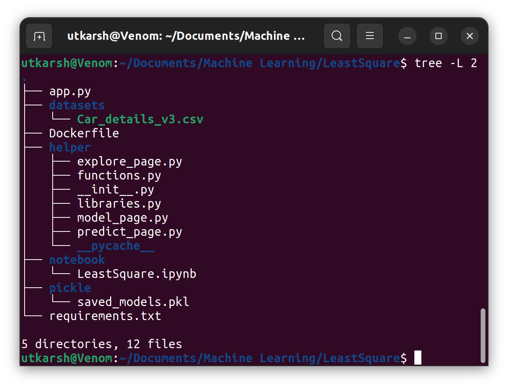
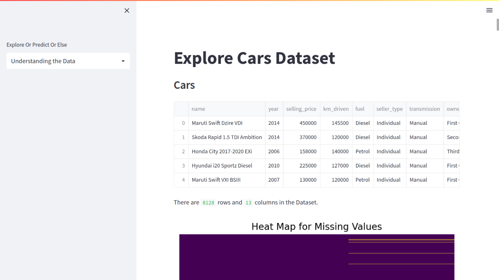
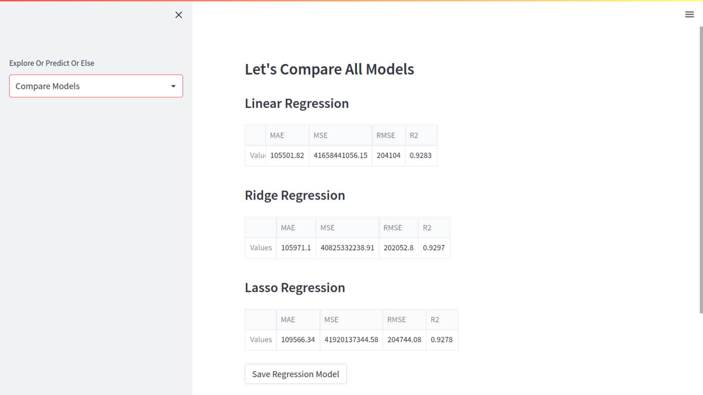
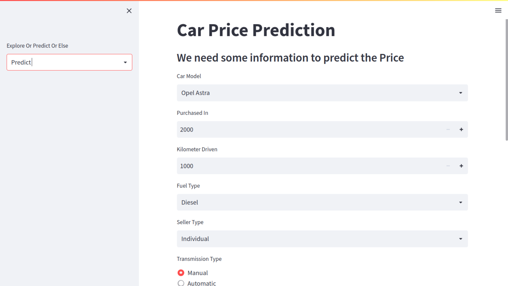

# Least Square

A simple Streamlit WebApp, which can predict Car Price with Machine Learning Models such as **Linear Regression, Ridge Regression, and Lasso Regression**.

[See Project Documentation](https://docs.google.com/document/d/1oW7xq0iSP3OqRFctUsz4QZQ90_T0gBaEjTF6NhJ-UrE/edit?usp=sharing)
### [See Demo on Heroku](https://least2.herokuapp.com/)

I've also trained this using **Neural Network**.
[See it on Colab](https://drive.google.com/file/d/1dTJbutFd8ykwrUlPHMy9j8tWd0sad1Db/view?usp=sharing)

## How to use?
### Clone this repository.
```bash
  git clone https://github.com/utkarshbelkhede/LeastSquare.git
```
### Method 1 - Using Docker
**Prerequisite** - Docker

1. Build Docker Images
```bash
  docker build -t leastsquare:latest .
```
2. Run App in Docker Container
```bash
  docker run leastsquare:latest
```
### Method 2 - Using Virtual Environment
**Prerequisite** - Conda, Python
1. Create a Conda Virtual Environment
```bash
  conda create -n leastsquare
```
2. Activate Virtual Environment
```bash
  conda activate leastsquare
```
3. Install Requirements.txt
```bash
  pip install -r requirements.txt
```
4. Run Streamlit App
```bash
  streamlit run app.py
```

## About Dataset

This data was scraped from [cars24.com](https://www.cars24.com/). 

I used [Octoparse](https://www.octoparse.com/download/windows) to scrape the data from the website.

- Name
- Variant
- Transmission
- km_driven
- Owner_Type
- Fuel
- Price
- Age (Derived from Year Purchased)

[Dataset Link](https://drive.google.com/file/d/11Ham5y71ng49ZKY7f1CS3d1BZgILUywV/view?usp=sharing)

## Project Organization


## Screenshots

### Explore Page



### Model Page



### Predict Page



### 🔗 Links

https://www.linkedin.com/in/utkarshbelkhede/

https://github.com/utkarshbelkhede